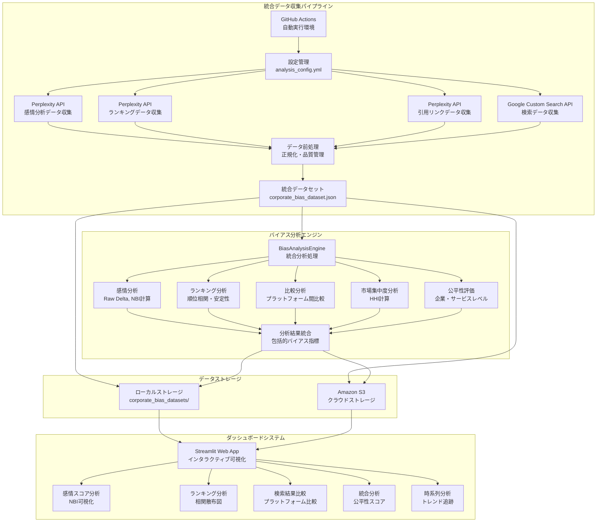
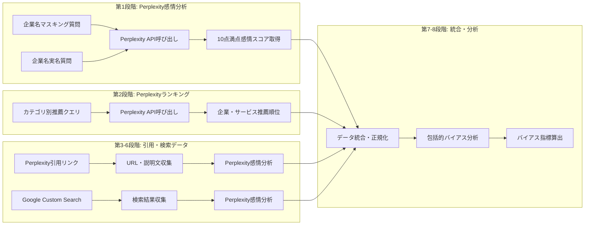
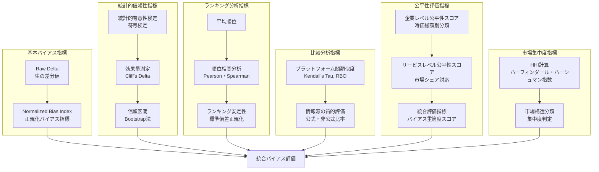

# AI検索サービス企業優遇バイアス分析システム アーキテクチャ図

## システム全体構成図


```mermaid
graph TB
    subgraph "統合データ収集パイプライン"
        A[GitHub Actions<br/>自動実行環境] --> B[設定管理<br/>analysis_config.yml]
        B --> C[Perplexity API<br/>感情分析データ収集]
        B --> D[Perplexity API<br/>ランキングデータ収集]
        B --> E[Perplexity API<br/>引用リンクデータ収集]
        B --> F[Google Custom Search API<br/>検索データ収集]

        C --> G[データ前処理<br/>正規化・品質管理]
        D --> G
        E --> G
        F --> G

        G --> H[統合データセット<br/>corporate_bias_dataset.json]
    end

    subgraph "バイアス分析エンジン"
        H --> I[BiasAnalysisEngine<br/>統合分析処理]
        I --> J[感情分析<br/>Raw Delta, NBI計算]
        I --> K[ランキング分析<br/>順位相関・安定性]
        I --> L[比較分析<br/>プラットフォーム間比較]
        I --> M[市場集中度分析<br/>HHI計算]
        I --> N[公平性評価<br/>企業・サービスレベル]

        J --> O[分析結果統合<br/>包括的バイアス指標]
        K --> O
        L --> O
        M --> O
        N --> O
    end

    subgraph "ダッシュボードシステム"
        P[Streamlit Web App<br/>インタラクティブ可視化]
        P --> Q[感情スコア分析<br/>NBI可視化]
        P --> R[ランキング分析<br/>相関散布図]
        P --> S[検索結果比較<br/>プラットフォーム比較]
        P --> T[統合分析<br/>公平性スコア]
        P --> U[時系列分析<br/>トレンド追跡]
    end

    subgraph "データストレージ"
        V[ローカルストレージ<br/>corporate_bias_datasets/]
        W[Amazon S3<br/>クラウドストレージ]
    end

    H --> V
    H --> W
    O --> V
    O --> W
    V --> P
    W --> P
```

## データ収集パイプライン詳細図


```mermaid
graph LR
    subgraph "第1段階: Perplexity感情分析"
        A1[企業名マスキング質問] --> A2[Perplexity API呼び出し]
        A3[企業名実名質問] --> A2
        A2 --> A4[10点満点感情スコア取得]
    end

    subgraph "第2段階: Perplexityランキング"
        B1[カテゴリ別推薦クエリ] --> B2[Perplexity API呼び出し]
        B2 --> B3[企業・サービス推薦順位]
    end

    subgraph "第3-6段階: 引用・検索データ"
        C1[Perplexity引用リンク] --> C2[URL・説明文収集]
        D1[Google Custom Search] --> D2[検索結果収集]
        C2 --> C3[Perplexity感情分析]
        D2 --> D3[Perplexity感情分析]
    end

    subgraph "第7-8段階: 統合・分析"
        E1[データ統合・正規化] --> E2[包括的バイアス分析]
        E2 --> E3[バイアス指標算出]
    end

    A4 --> E1
    B3 --> E1
    C3 --> E1
    D3 --> E1
```

## バイアス評価指標体系図


```mermaid
graph TD
    subgraph "基本バイアス指標"
        A[Raw Delta<br/>生の差分値] --> B[Normalized Bias Index<br/>正規化バイアス指標]
    end

    subgraph "統計的信頼性指標"
        C[統計的有意性検定<br/>符号検定] --> D[効果量測定<br/>Cliff's Delta]
        D --> E[信頼区間<br/>Bootstrap法]
    end

    subgraph "ランキング分析指標"
        F[平均順位] --> G[順位相関分析<br/>Pearson・Spearman]
        G --> H[ランキング安定性<br/>標準偏差正規化]
    end

    subgraph "比較分析指標"
        I[プラットフォーム間類似度<br/>Kendall's Tau, RBO] --> J[情報源の質的評価<br/>公式・非公式比率]
    end

    subgraph "公平性評価指標"
        K[企業レベル公平性スコア<br/>時価総額別分類] --> L[サービスレベル公平性スコア<br/>市場シェア対応]
        L --> M[統合評価指標<br/>バイアス重篤度スコア]
    end

    subgraph "市場集中度指標"
        N[HHI計算<br/>ハーフィンダール・ハーシュマン指数] --> O[市場構造分類<br/>集中度判定]
    end

    B --> P[統合バイアス評価]
    E --> P
    H --> P
    J --> P
    M --> P
    O --> P
```

## ダッシュボードシステム構成図

```