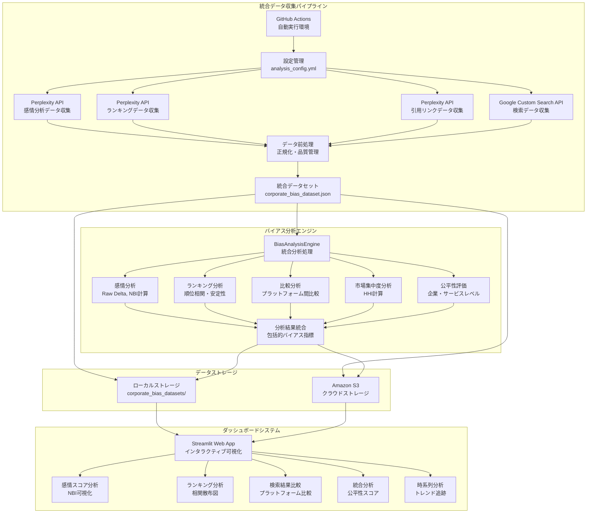
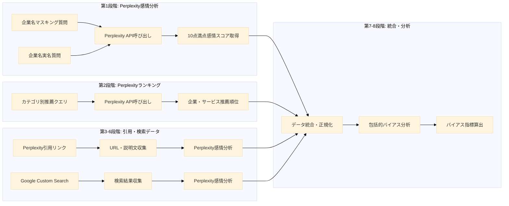
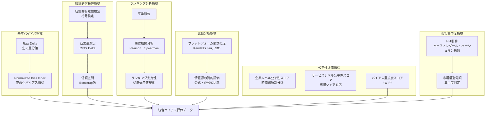
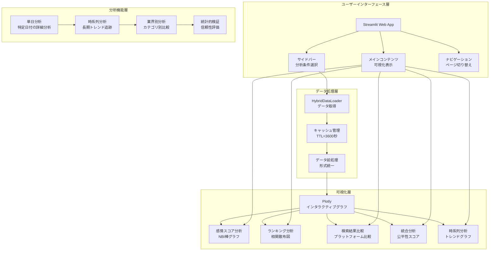
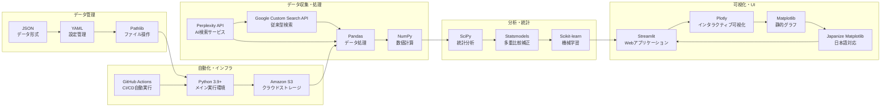

# AI検索サービス企業優遇バイアス分析システム アーキテクチャ図

## システム全体構成図

## データ収集パイプライン詳細図

## バイアス評価指標体系図

## ダッシュボードシステム構成図

## 技術スタック構成図

## システム特性・優位性

### 1. 自動化による客観性確保
- GitHub Actionsによる完全自動実行
- 研究者の主観的判断の排除
- 24時間体制での継続監視

### 2. 多角的分析による包括的理解
- 感情分析 × ランキング分析の統合
- プラットフォーム間比較分析
- 市場構造との相関分析

### 3. 学術研究基盤としての貢献
- オープンソースでの公開
- 再現可能性の確保
- 標準化された指標体系

### 4. 実用的Webダッシュボード
- 直感的な操作インターフェース
- 専門知識不要の分析環境
- 多様なステークホルダー対応

### 5. 日本語圏特化設定
- 日本語での検索・回答分析
- 地域・文化的背景の考慮
- 日本企業・市場への特化

---

*図1: AI検索サービス企業優遇バイアス分析システムの全体アーキテクチャ*

*図2: 8段階データ収集パイプラインの詳細フロー*

*図3: 包括的バイアス評価指標体系*

*図4: Streamlitダッシュボードシステム構成*

*図5: 技術スタックとコンポーネント関係*