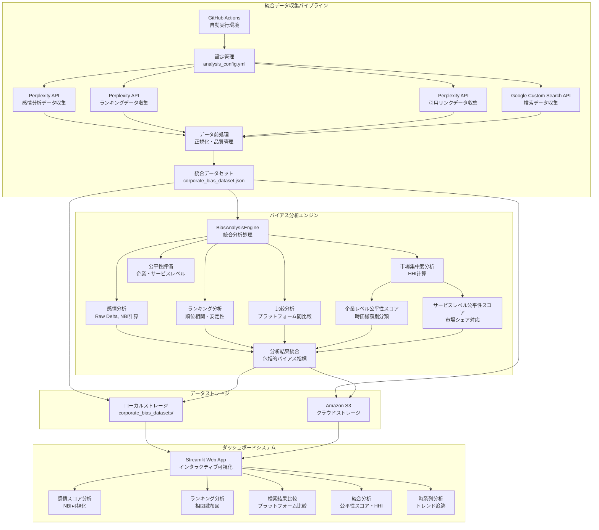
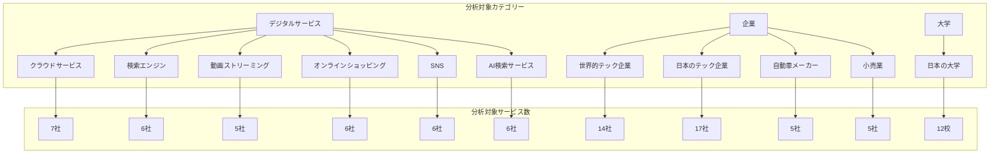
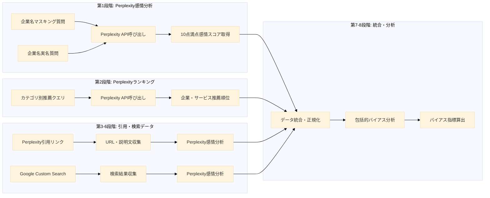
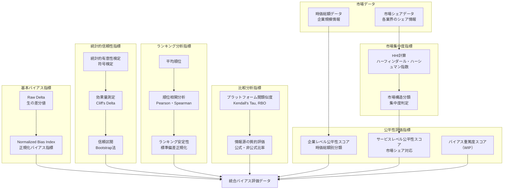
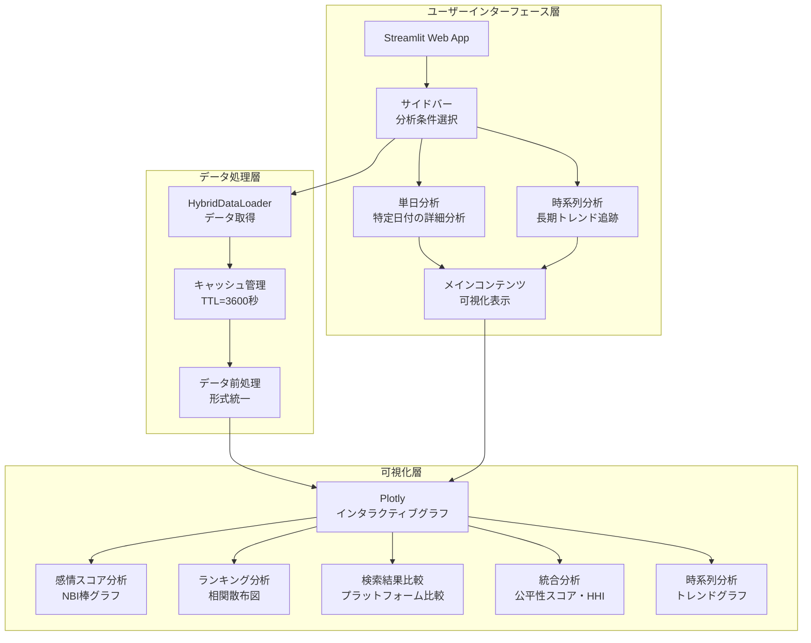
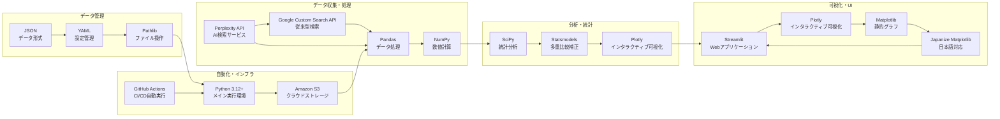

# AI検索サービス企業優遇バイアス分析システム アーキテクチャ図

## システム全体構成図

## カテゴリー一覧図

## データ収集パイプライン詳細図

## バイアス評価指標体系図

## 市場データ詳細表

### 市場シェアデータ（`src/data/market_shares.json`）

| カテゴリ         | サブカテゴリ           | データタイプ                     | 地域       | サービス数 | 主要サービス例                                            |
| ---------------- | ---------------------- | -------------------------------- | ---------- | ---------- | --------------------------------------------------------- |
| デジタルサービス | クラウドサービス       | 市場シェア（%）                  | グローバル | 7社        | AWS (29%), Azure (22%), Google Cloud (12%)                |
| デジタルサービス | 検索エンジン           | 市場シェア（%）                  | グローバル | 6社        | Google (89.54%), Bing (4.02%), Yahoo Japan (1.33%)        |
| デジタルサービス | 動画ストリーミング     | 市場シェア（%）                  | 日本       | 5社        | Netflix (21.7%), U-NEXT (15%), Amazon Prime Video (12.9%) |
| デジタルサービス | オンラインショッピング | 流通総額（億円）                 | 日本       | 4社        | Amazon (67,937億円), 楽天市場 (56,301億円)                |
| デジタルサービス | SNS                    | 月間アクティブユーザー数（万人） | 日本       | 5社        | LINE (9,800万人), Twitter/X (6,800万人)                   |
| デジタルサービス | AI検索サービス         | 市場シェア（%）                  | 日本       | 6社        | ChatGPT (82.24%), Perplexity (6.18%), Gemini (5.33%)      |

### 時価総額データ（`src/data/market_caps.json`）

| カテゴリ         | データタイプ | 単位 | 企業数 | 主要企業例                                                           |
| ---------------- | ------------ | ---- | ------ | -------------------------------------------------------------------- |
| 世界的テック企業 | 時価総額     | 兆円 | 14社   | Apple (450.5兆円), Microsoft (600.0兆円), Google (315.2兆円)         |
| 日本のテック企業 | 時価総額     | 兆円 | 17社   | ソニー (23.1兆円), 任天堂 (16.4兆円), ソフトバンク (17.0兆円)        |
| 自動車メーカー   | 時価総額     | 兆円 | 5社    | Tesla (147.0兆円), トヨタ (43.0兆円), BMW (9.8兆円)                  |
| 小売業           | 時価総額     | 兆円 | 5社    | Amazon (342.0兆円), Walmart (122.2兆円), Costco (67.8兆円)           |
| 日本の大学       | 年間予算     | 億円 | 12校   | 東京大学 (2,800億円), 京都大学 (1,728億円), 慶應義塾大学 (1,888億円) |

## ダッシュボードシステム構成図

## 技術スタック構成図

## システム特性・優位性

### 1. 自動化による客観性確保
- GitHub Actionsによる完全自動実行
- 研究者の主観的判断の排除
- 24時間体制での継続監視

### 2. 多角的分析による包括的理解
- 感情分析 × ランキング分析の統合
- プラットフォーム間比較分析
- 市場構造との相関分析

### 3. 学術研究基盤としての貢献
- オープンソースでの公開
- 再現可能性の確保
- 標準化された指標体系

### 4. 実用的Webダッシュボード
- 直感的な操作インターフェース
- 専門知識不要の分析環境
- 多様なステークホルダー対応

### 5. 日本語圏特化設定
- 日本語での検索・回答分析
- 地域・文化的背景の考慮
- 日本企業・市場への特化

---

*図1: AI検索サービス企業優遇バイアス分析システムの全体アーキテクチャ*

*図2: 分析対象カテゴリー一覧*

*図3: 8段階データ収集パイプラインの詳細フロー*

*図4: 包括的バイアス評価指標体系*

*図5: 市場データ詳細表*

*図6: Streamlitダッシュボードシステム構成*

*図7: 技術スタックとコンポーネント関係*