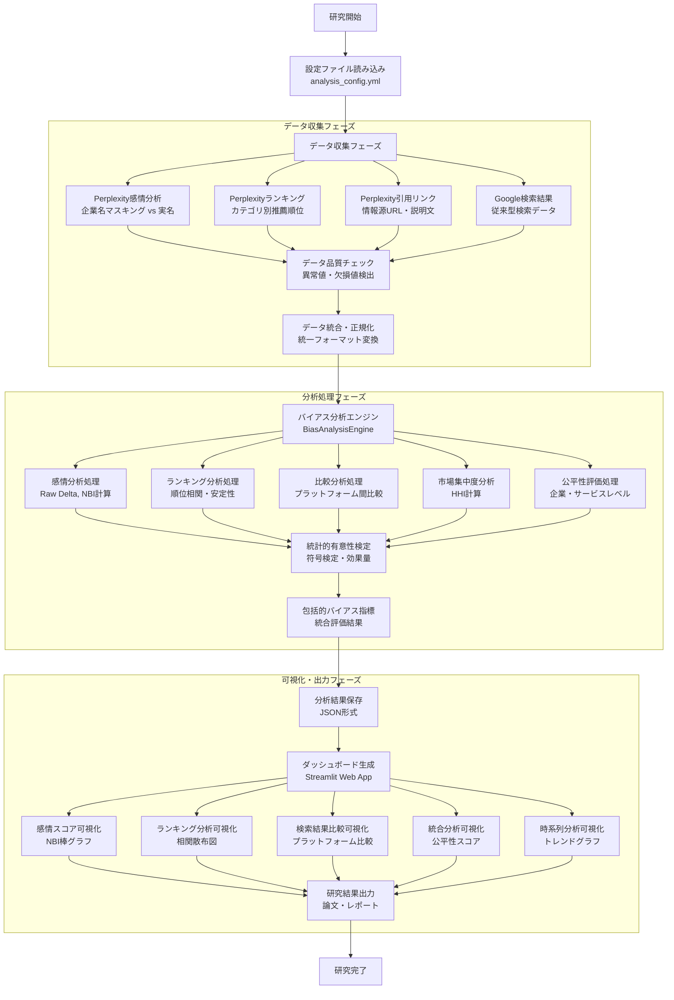
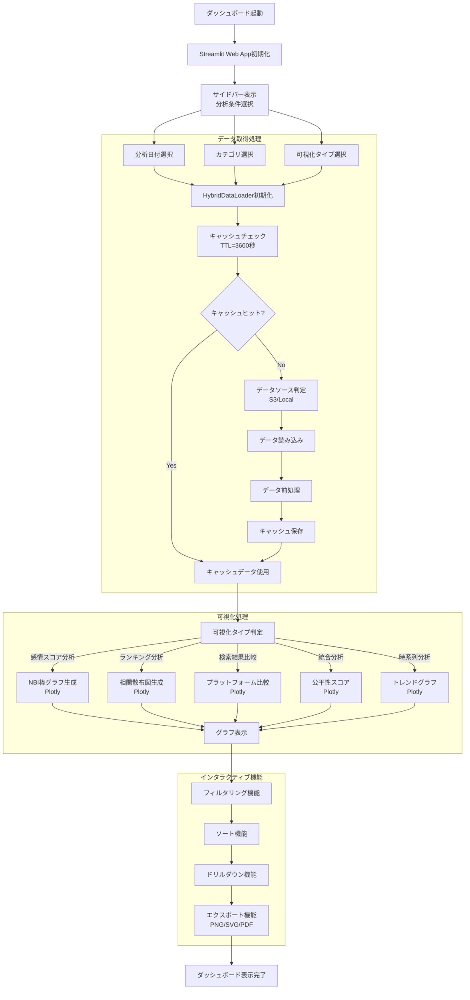
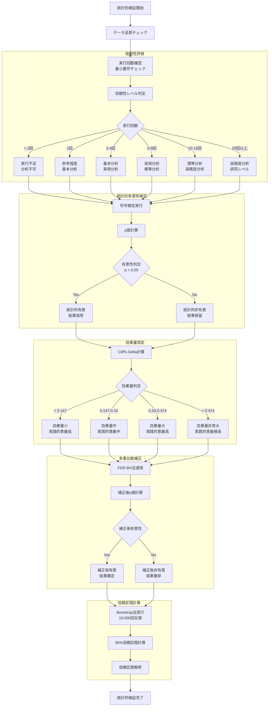
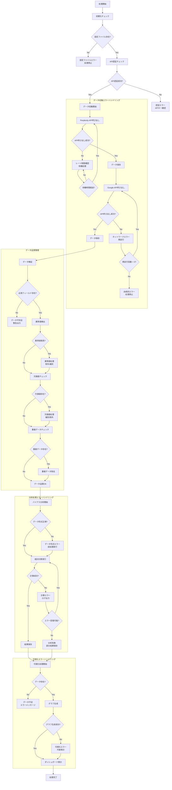
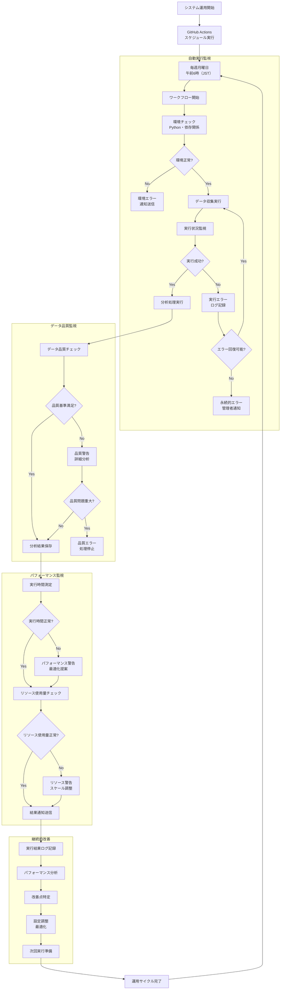

# AI検索サービス企業優遇バイアス分析システム フロー図

## システム全体フロー図



## データ収集詳細フロー図

```mermaid
flowchart TD
    A[データ収集開始] --> B[設定ファイル読み込み]
    B --> C[対象企業・サービスリスト取得]
    C --> D[実行回数設定<br/>デフォルト15回]

    subgraph "第1段階: Perplexity感情分析"
        D --> E[企業名マスキング質問生成]
        E --> F[企業名実名質問生成]
        F --> G[Perplexity API呼び出し<br/>sonarモデル使用]
        G --> H[10点満点感情スコア取得]
        H --> I[感情スコアデータ保存]
    end

    subgraph "第2段階: Perplexityランキング"
        I --> J[カテゴリ別推薦クエリ生成]
        J --> K[Perplexity API呼び出し]
        K --> L[企業・サービス推薦順位取得]
        L --> M[ランキングデータ保存]
    end

    subgraph "第3段階: Perplexity引用リンク"
        M --> N[引用リンクデータ収集]
        N --> O[URL・説明文抽出]
        O --> P[引用リンクデータ保存]
    end

    subgraph "第4段階: Google検索データ"
        P --> Q[Google Custom Search API呼び出し]
        Q --> R[検索結果データ取得]
        R --> S[Google検索データ保存]
    end

    subgraph "第5段階: 引用データ感情分析"
        S --> T[引用リンクデータ読み込み]
        T --> U[Perplexity API感情分析]
        U --> V[引用データ感情スコア保存]
    end

    subgraph "第6段階: Googleデータ感情分析"
        V --> W[Google検索データ読み込み]
        W --> X[Perplexity API感情分析]
        X --> Y[Googleデータ感情スコア保存]
    end

    subgraph "第7段階: データ統合"
        Y --> Z[全データセット統合]
        Z --> AA[データ正規化処理]
        AA --> BB[統合データセット保存<br/>corporate_bias_dataset.json]
    end

    subgraph "第8段階: データ品質管理"
        BB --> CC[異常値検出]
        CC --> DD[欠損値処理]
        DD --> EE[重複データ除去]
        EE --> FF[データ品質レポート生成]
    end

    FF --> GG[データ収集完了]
```



## バイアス分析処理フロー図

```mermaid
flowchart TD
    A[分析開始] --> B[統合データセット読み込み]
    B --> C[データ検証<br/>必須フィールドチェック]
    C --> D[実行回数確認<br/>統計的有意性判定]

    subgraph "感情分析処理"
        D --> E[企業別感情スコア抽出]
        E --> F[マスキング vs 実名比較]
        F --> G[Raw Delta計算<br/>Δ = unmasked - masked]
        G --> H[カテゴリ内正規化<br/>NBI = Δ / 平均|Δ|]
        H --> I[統計的有意性検定<br/>符号検定]
        I --> J[効果量測定<br/>Cliff's Delta]
        J --> K[信頼区間計算<br/>Bootstrap法]
    end

    subgraph "ランキング分析処理"
        K --> L[ランキングデータ抽出]
        L --> M[平均順位計算]
        M --> N[順位相関分析<br/>Pearson・Spearman]
        N --> O[ランキング安定性評価<br/>標準偏差正規化]
        O --> P[ランキング品質評価<br/>一貫性チェック]
    end

    subgraph "比較分析処理"
        P --> Q[プラットフォーム間比較]
        Q --> R[Kendall's Tau計算<br/>順位相関]
        R --> S[RBO計算<br/>Rank Biased Overlap]
        S --> T[重複サイト数分析]
        T --> U[公式・非公式ドメイン比率]
        U --> V[感情比率比較<br/>ポジ・ネガ・ニュートラル]
    end

    subgraph "市場集中度分析"
        V --> W[市場シェアデータ読み込み]
        W --> X[HHI計算<br/>Σ(シェア%)²]
        X --> Y[市場構造分類<br/>集中度判定]
        Y --> Z[企業規模別分類<br/>時価総額基準]
    end

    subgraph "公平性評価処理"
        Z --> AA[企業レベル公平性スコア]
        AA --> BB[サービスレベル公平性スコア]
        BB --> CC[統合公平性評価]
        CC --> DD[バイアス重篤度スコア]
    end

    DD --> EE[分析結果統合]
    EE --> FF[包括的バイアス指標生成]
    FF --> GG[分析完了]
```

## ダッシュボード表示フロー図



## 統計的検証フロー図



## エラーハンドリング・品質管理フロー図



## システム運用・監視フロー図



---

*図6: システム全体フロー図*

*図7: 8段階データ収集詳細フロー*

*図8: バイアス分析処理フロー*

*図9: ダッシュボード表示フロー*

*図10: 統計的検証フロー*

*図11: エラーハンドリング・品質管理フロー*

*図12: システム運用・監視フロー*