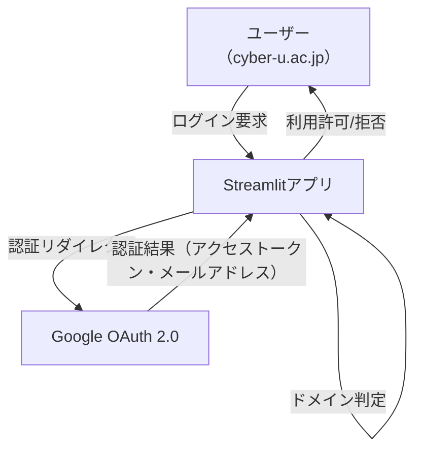

# Streamlitアプリ用 Google OAuth + ドメイン制限認証機能 設計書

## 1. 目的

- サイバー大学（cyber-u.ac.jp）ドメインのGoogleアカウントを持つユーザーのみがStreamlitアプリにログイン・利用できるようにする。

---

## 2. 認証方式の概要

- Google OAuth 2.0を利用し、Googleアカウントでログイン。
- 認証後、取得したメールアドレスが「@cyber-u.ac.jp」で終わる場合のみアプリ利用を許可。
- それ以外のドメインの場合はエラーメッセージを表示し、利用不可とする。

---

## 3. システム構成



---

## 4. 実装詳細

### 4.1. Google Cloud Console 設定

1. Google Cloud Consoleで新規プロジェクト作成
2. 「OAuth同意画面」を設定（外部、cyber-u.ac.jpユーザーのみ許可可）
3. 「認証情報」→「OAuth 2.0 クライアントID」を作成
   - アプリケーション種別：ウェブアプリ
   - 承認済みリダイレクトURI：
     例）`http://localhost:8501`（ローカル開発時）
     本番環境では本番URLを指定
4. クライアントID・クライアントシークレットを取得

---

### 4.2. Streamlitアプリ側 実装

#### 必要ライブラリ

- `streamlit`
- `streamlit-oauth`（または`authlib`等のOAuth2クライアント）

#### 認証フロー

1. 「Googleでログイン」ボタンを表示
2. ボタン押下でGoogle OAuth認証画面へリダイレクト
3. 認証後、アクセストークンとユーザー情報（メールアドレス）を取得
4. メールアドレスが「@cyber-u.ac.jp」で終わるか判定
   - OK：アプリ本体を表示
   - NG：エラーメッセージ表示、利用不可

#### サンプルコード（イメージ）

```python
import streamlit as st
from streamlit_oauth import OAuth2Component

client_id = "YOUR_GOOGLE_CLIENT_ID"
client_secret = "YOUR_GOOGLE_CLIENT_SECRET"
redirect_uri = "http://localhost:8501"

oauth2 = OAuth2Component(
    client_id=client_id,
    client_secret=client_secret,
    authorize_endpoint="https://accounts.google.com/o/oauth2/v2/auth",
    token_endpoint="https://oauth2.googleapis.com/token",
    revoke_endpoint="https://oauth2.googleapis.com/revoke",
    redirect_uri=redirect_uri,
    scope="openid email profile"
)

result = oauth2.authorize_button("Googleでログイン")

if result and "email" in result:
    email = result["email"]
    if email.endswith("@cyber-u.ac.jp"):
        st.success(f"ログイン成功: {email}")
        # アプリ本体の処理
    else:
        st.error("cyber-u.ac.jpドメインのメールアドレスでログインしてください。")
else:
    st.info("Googleアカウントでログインしてください。")
```

---

### 4.3. セキュリティ・運用上の注意

- クライアントID/シークレットは環境変数や`.env`ファイル等で安全に管理
- 本番環境ではHTTPSを必須とする
- Google Cloud ConsoleのOAuth同意画面で「ユーザータイプ」を「外部」にし、cyber-u.ac.jpドメインのユーザーのみ許可する設定が可能
- 不正アクセスやセッション管理に注意（Streamlitのセッション管理は簡易的なので、必要に応じて強化）

---

## 5. 画面仕様

- ログイン前：
  「Googleでログイン」ボタンのみ表示
- ログイン後（許可ドメイン）：
  アプリ本体を表示
- ログイン後（非許可ドメイン）：
  「cyber-u.ac.jpドメインのメールアドレスでログインしてください。」と表示し、アプリ本体は非表示

---

## 6. 拡張・応用案

- サイバー大学以外のドメイン追加許可
- 管理者権限ユーザーの区別
- ログイン履歴の記録
- ログアウト機能の追加

---

## 7. Streamlit Community Cloudでの実現方法

### 7.1. 概要

Streamlit Community Cloud（https://streamlit.io/cloud）は、Streamlit公式の無料ホスティングサービスです。サーバー管理不要で、GitHubリポジトリと連携してアプリを公開できます。

### 7.2. 手順

1. **GitHubリポジトリにアプリをPush**
   - `app.py`や必要なファイルをGitHubにアップロード
2. **Streamlit Community Cloudにサインイン**
   - Googleアカウント等でサインイン
3. **「New app」からリポジトリを指定してデプロイ**
   - 必要に応じて環境変数（Google OAuthのクライアントID/シークレット等）を「Secrets」機能で設定
4. **Google Cloud ConsoleでリダイレクトURIをStreamlit CloudのURLに追加**
   - 例：`https://<your-app-name>-<your-username>.streamlit.app`
5. **アプリを公開**
   - 公開URLをユーザーに案内

### 7.3. 注意点

- Streamlit Cloudの「Secrets」機能でクライアントID/シークレットを安全に管理
- Google Cloud ConsoleのリダイレクトURIは正確に設定
- サイバー大学ドメイン以外のユーザーはアプリ利用不可
- 無料枠には起動時間やリソース制限あり

---

## 8. 参考

- [Google Cloud OAuth 2.0 ドキュメント](https://developers.google.com/identity/protocols/oauth2)
- [streamlit-oauth GitHub](https://github.com/ai-yash/st-oauth)
- [streamlit-authenticator GitHub](https://github.com/mkhorasani/Streamlit-Authenticator)
- [Streamlit Community Cloud公式](https://streamlit.io/cloud)

---

ご要望に応じて、
- 画面遷移図
- サンプルコードの具体化
- 本番運用時のセキュリティ設計
なども追記可能です。ご指示ください。