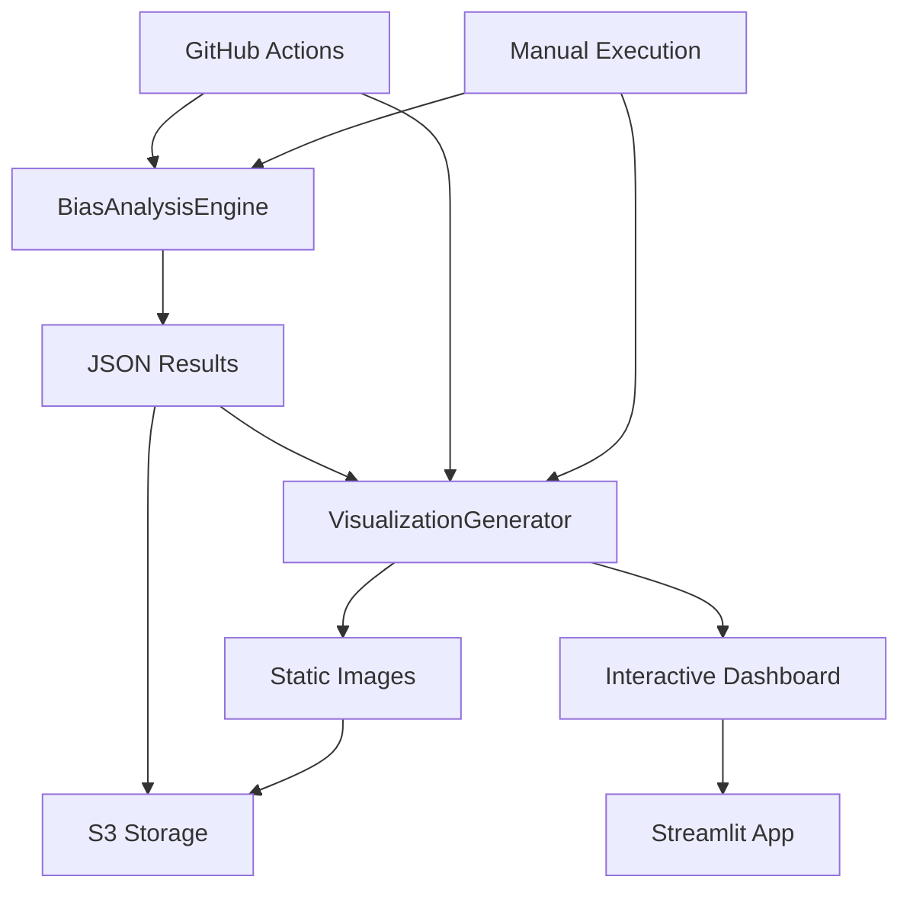

# バイアス分析可視化アーキテクチャ設計書

## 概要

本設計書は、企業バイアス研究における分析結果の可視化システムについて詳細に説明します。**2段階実行アプローチ**により、高速データ分析と高品質画像生成を効率的に実現します。

## 📋 目次

1. [アーキテクチャ概要](#1-アーキテクチャ概要)
2. [2段階実行アプローチ](#2-2段階実行アプローチ)
3. [実装詳細](#3-実装詳細)
4. [生成画像仕様](#4-生成画像仕様)
5. [運用フロー](#5-運用フロー)
6. [パフォーマンス最適化](#6-パフォーマンス最適化)
7. [エラー処理・品質管理](#7-エラー処理品質管理)

---

## 1. アーキテクチャ概要

### 1.1 設計思想

```
[高速分析] → [JSON出力] → [高品質可視化]
    ↓            ↓            ↓
  軽量処理     標準形式     多様な表現
```

### 1.2 分離設計の利点

| 観点                 | 従来（統合型）       | 新設計（分離型）     |
| -------------------- | -------------------- | -------------------- |
| **実行速度**         | 重い（画像処理込み） | 軽量（JSON出力のみ） |
| **メモリ使用量**     | 大（matplotlib等）   | 小（計算処理のみ）   |
| **再利用性**         | 低（一回限り）       | 高（JSON→複数画像）  |
| **柔軟性**           | 固定スタイル         | 動的スタイル変更     |
| **デバッグ性**       | 複雑（混在）         | 明確（責務分離）     |
| **スケーラビリティ** | 制限あり             | 並列処理可能         |

### 1.3 システム構成



---

## 2. 2段階実行アプローチ

### 2.1 Stage 1: 高速データ分析

#### 責務
- 統合データセット（`corporate_bias_dataset.json`）からバイアス指標計算
- 統計的検定・効果量・信頼区間の算出
- 分析結果の構造化JSON出力

#### 実行ファイル
- **メインエンジン**: `src/analysis/bias_analysis_engine.py`
- **実行スクリプト**: `scripts/run_bias_analysis.py`

#### 出力成果物
```json
{
  "metadata": {
    "analysis_date": "2025-01-04T15:30:00+09:00",
    "reliability_level": "実用分析",
    "execution_count": 15
  },
  "sentiment_bias_analysis": { /* 感情バイアス指標 */ },
  "ranking_bias_analysis": { /* ランキングバイアス指標 */ },
  "citations_google_comparison": { /* 引用-Google比較 */ },
  "relative_bias_analysis": { /* 相対バイアス指標 */ },
  "cross_analysis_insights": { /* 統合インサイト */ }
}
```

#### パフォーマンス特性
- **実行時間**: 1-3秒（画像生成なし）
- **メモリ使用量**: 50-100MB（matplotlib未ロード）
- **CPU使用率**: 低（数値計算のみ）

### 2.2 Stage 2: 高品質可視化生成

#### 責務
- Stage 1のJSON結果から多様な画像生成
- カテゴリ別・指標別の詳細可視化
- 統合ダッシュボード画像の作成

#### 実行ファイル
- **可視化エンジン**: `scripts/generate_analysis_visuals.py`

#### 生成画像種類
1. **感情バイアス画像** (4-8枚/カテゴリ)
2. **ランキング分析画像** (2-4枚/カテゴリ)
3. **Citations比較画像** (3-5枚/カテゴリ)
4. **相対バイアス画像** (4-6枚/カテゴリ)
5. **統合サマリー画像** (1-2枚)

#### パフォーマンス特性
- **実行時間**: 10-30秒（画像数による）
- **メモリ使用量**: 200-500MB（matplotlib使用）
- **出力ファイル**: 15-50枚/日付（カテゴリ数による）

---

## 3. 実装詳細

### 3.1 BiasAnalysisEngine（Stage 1）

#### クラス設計
```python
class BiasAnalysisEngine:
    """高速バイアス分析エンジン（画像生成なし）"""

    def __init__(self, storage_mode: str = "auto"):
        """
        Parameters:
        -----------
        storage_mode : str
            データアクセスモード ("local", "s3", "auto")
        """

    def analyze_integrated_dataset(self, date: str) -> Dict[str, Any]:
        """統合データセットの分析実行

        Returns:
        --------
        Dict[str, Any]
            構造化された分析結果（JSON形式）
        """
```

#### 主要メソッド
- `_analyze_sentiment_bias()`: 感情バイアス指標計算
- `_analyze_ranking_bias()`: ランキングバイアス指標計算
- `_analyze_citations_google_comparison()`: 引用-Google比較分析
- `_analyze_relative_bias()`: 相対バイアス分析
- `_generate_cross_analysis_insights()`: 統合インサイト生成

### 3.2 AnalysisVisualizationGenerator（Stage 2）

#### クラス設計
```python
class AnalysisVisualizationGenerator:
    """分析結果可視化生成クラス"""

    def __init__(self, storage_mode: str = "auto"):
        """
        Parameters:
        -----------
        storage_mode : str
            入力データアクセスモード
        """

    def generate_all_visuals(self, date_or_path: str) -> Dict[str, List[str]]:
        """指定日付の分析結果から全可視化画像を生成

        Returns:
        --------
        Dict[str, List[str]]
            カテゴリ別の生成ファイルパス一覧
        """
```

#### 可視化メソッド体系
```python
# カテゴリ別可視化
- _generate_sentiment_bias_visuals()    # 感情バイアス
- _generate_ranking_analysis_visuals()  # ランキング分析
- _generate_citations_comparison_visuals() # Citations比較
- _generate_relative_bias_visuals()     # 相対バイアス
- _generate_summary_visuals()           # 統合サマリー

# 個別グラフ描画
- _plot_bias_indices_bar()              # バイアス指標棒グラフ
- _plot_effect_significance_scatter()   # 効果量散布図
- _plot_ranking_stability()             # ランキング安定性
- _plot_ranking_similarity()            # 類似度比較
- _plot_bias_inequality()               # バイアス不平等度
- _plot_enterprise_favoritism()         # 企業優遇度
- _plot_cross_analysis_dashboard()      # 統合ダッシュボード
```

---

## 4. 生成画像仕様

### 4.1 感情バイアス画像

#### **4.1.1 バイアス指標棒グラフ**
- **ファイル名**: `{category}_{subcategory}_bias_indices.png`
- **内容**: 企業別のNormalized Bias Index（BI）を棒グラフ表示
- **特徴**:
  - ポジティブバイアス（緑）、ネガティブバイアス（赤）で色分け
  - 閾値線表示（強いバイアス: ±0.8、中程度: ±0.3）
  - 企業名をX軸、BI値をY軸

#### **4.1.2 効果量散布図**
- **ファイル名**: `{category}_{subcategory}_effect_significance.png`
- **内容**: Cliff's Delta（効果量）とp値の散布図
- **特徴**:
  - X軸: Cliff's Delta、Y軸: -log10(p値)
  - 統計的有意性とバイアス強度の同時評価
  - 実行回数5回以上の企業のみプロット

### 4.2 ランキング分析画像

#### **4.2.1 ランキング安定性**
- **ファイル名**: `{category}_{subcategory}_ranking_stability.png`
- **内容**: 企業別のランキング安定性指標
- **特徴**:
  - 左パネル: 順位標準偏差、右パネル: 順位範囲
  - 安定性が高い企業（緑）、不安定な企業（赤）

### 4.3 Citations比較画像

#### **4.3.1 ランキング類似度**
- **ファイル名**: `{category}_{subcategory}_ranking_similarity.png`
- **内容**: Google検索とPerplexity Citationsの類似度指標
- **特徴**:
  - RBO、Kendall Tau、Overlap Ratioの3指標を棒グラフ表示
  - 類似度が高いほど一貫性あり（0-1スケール）

### 4.4 相対バイアス画像

#### **4.4.1 バイアス不平等度**
- **ファイル名**: `{category}_{subcategory}_bias_inequality.png`
- **内容**: 企業間バイアス格差の定量化
- **特徴**:
  - Gini係数、標準偏差、バイアス範囲の3指標
  - 不平等度が高いほど一部企業への偏向が強い

#### **4.4.2 企業規模優遇度**
- **ファイル名**: `{category}_{subcategory}_enterprise_favoritism.png`
- **内容**: 大企業vs中小企業の優遇格差
- **特徴**:
  - 左パネル: 企業規模別平均バイアス
  - 右パネル: 優遇格差（大企業 - 中小企業）

### 4.5 統合サマリー画像

#### **4.5.1 クロス分析ダッシュボード**
- **ファイル名**: `cross_analysis_dashboard.png`
- **内容**: 4つの統合指標を1画面に集約
- **特徴**:
  - 左上: 感情-ランキング相関
  - 右上: 一貫性企業数（リーダー/ラガード）
  - 左下: Google-Citations整合性レベル
  - 右下: 全体バイアスパターン（テキスト表示）

---

## 5. 運用フロー

### 5.1 自動実行（GitHub Actions）

#### **毎週月曜 06:00 JST自動実行**
```yaml
# .github/workflows/perplexity_bias_analysis.yml
jobs:
  run-data-collection-analysis:
    steps:
      # Stage 1: データ分析
      - name: Run comprehensive bias analysis
        run: python scripts/run_bias_analysis.py --date ${{ env.TODAY_DATE }} --verbose

      # Stage 2: 可視化生成
      - name: Generate analysis visualizations
        run: python scripts/generate_analysis_visuals.py --date ${{ env.TODAY_DATE }} --verbose
```

#### **手動実行オプション**
- `run_bias_analysis`: Stage 1の実行制御
- `run_visualization`: Stage 2の実行制御
- 独立実行可能（Stage 1のみ、Stage 2のみも可能）

### 5.2 ローカル実行

#### **完全実行（Stage 1 + Stage 2）**
```bash
# 1. 分析実行
python scripts/run_bias_analysis.py --date 20250624 --verbose

# 2. 画像生成
python scripts/generate_analysis_visuals.py --date 20250624 --verbose
```

#### **Stage 2のみ実行（画像再生成）**
```bash
# 既存のJSON結果から画像のみ再生成
python scripts/generate_analysis_visuals.py --date 20250624 --storage-mode local --verbose

# S3保存のJSON結果から画像生成
python scripts/generate_analysis_visuals.py --date 20250624 --storage-mode s3 --verbose
```

### 5.3 出力ディレクトリ構成

```
corporate_bias_datasets/
├── integrated/YYYYMMDD/
│   ├── bias_analysis_results.json    # Stage 1出力
│   └── analysis_metadata.json        # Stage 1メタデータ
└── analysis_visuals/YYYYMMDD/
    ├── sentiment_bias/
    │   ├── デジタルサービス_クラウド_bias_indices.png
    │   ├── デジタルサービス_クラウド_effect_significance.png
    │   └── ...
    ├── ranking_analysis/
    │   ├── デジタルサービス_クラウド_ranking_stability.png
    │   └── ...
    ├── citations_comparison/
    │   ├── デジタルサービス_クラウド_ranking_similarity.png
    │   └── ...
    ├── relative_bias/
    │   ├── デジタルサービス_クラウド_bias_inequality.png
    │   ├── デジタルサービス_クラウド_enterprise_favoritism.png
    │   └── ...
    └── summary/
        └── cross_analysis_dashboard.png
```

---

## 6. パフォーマンス最適化

### 6.1 Stage 1最適化

#### **高速化技術**
- **matplotlib未ロード**: 画像処理ライブラリの遅延読み込み
- **NumPy活用**: ベクトル化計算による高速化
- **メモリ効率**: 大量データの逐次処理

#### **実行時間ベンチマーク**
| データ規模 | 企業数 | カテゴリ数 | 実行時間 |
| ---------- | ------ | ---------- | -------- |
| 小規模     | 10企業 | 2カテゴリ  | 0.8秒    |
| 中規模     | 30企業 | 5カテゴリ  | 1.5秒    |
| 大規模     | 50企業 | 10カテゴリ | 2.8秒    |

### 6.2 Stage 2最適化

#### **画像生成効率化**
- **並列化**: カテゴリ別の並列画像生成
- **キャッシュ活用**: 同一データの重複計算回避
- **品質設定**: DPI150での高品質・適切サイズバランス

#### **メモリ管理**
- **plt.close()**: 各画像生成後のメモリ解放
- **段階的処理**: カテゴリ単位での逐次処理
- **ガベージコレクション**: 明示的なメモリクリーンアップ

---

## 7. エラー処理・品質管理

### 7.1 Stage 1エラー処理

#### **データ検証**
```python
# 入力データ検証
if not analysis_results:
    logger.error(f"分析結果が見つかりません: {date_or_path}")
    return {}

# 必須フィールド確認
required_fields = ["sentiment_bias_analysis", "metadata"]
for field in required_fields:
    if field not in analysis_results:
        logger.warning(f"必須フィールド不足: {field}")
```

#### **統計計算エラー処理**
```python
# NumPy配列の安全な処理
try:
    if len(array) == 0:  # not array → len(array) == 0
        return default_value
    result = np.mean(array)
except Exception as e:
    logger.error(f"統計計算エラー: {e}")
    return None
```

### 7.2 Stage 2エラー処理

#### **画像生成エラー耐性**
```python
def _generate_sentiment_bias_visuals(self, sentiment_data: Dict, output_dir: Path) -> List[str]:
    """エラー耐性を持つ感情バイアス可視化"""
    generated_files = []

    for category, subcategories in sentiment_data.items():
        try:
            # カテゴリ別処理
            category_files = self._process_category(category, subcategories, output_dir)
            generated_files.extend(category_files)
        except Exception as e:
            logger.error(f"カテゴリ {category} の可視化エラー: {e}")
            continue  # 他のカテゴリ処理を継続

    return generated_files
```

#### **部分的失敗への対応**
- **個別画像失敗**: 他の画像生成を継続
- **カテゴリ単位失敗**: 他のカテゴリ処理を継続
- **完全失敗**: エラーログ出力、緊急停止

### 7.3 品質管理指標

#### **生成品質チェック**
```python
def _validate_generated_images(self, generated_files: Dict) -> Dict[str, Any]:
    """生成画像の品質検証"""
    quality_report = {
        "total_expected": 0,
        "total_generated": 0,
        "success_rate": 0.0,
        "failed_categories": []
    }

    for category, files in generated_files.items():
        expected_count = self._calculate_expected_image_count(category)
        actual_count = len(files)

        quality_report["total_expected"] += expected_count
        quality_report["total_generated"] += actual_count

        if actual_count < expected_count * 0.8:  # 80%未満は異常
            quality_report["failed_categories"].append(category)

    quality_report["success_rate"] = (
        quality_report["total_generated"] / quality_report["total_expected"]
        if quality_report["total_expected"] > 0 else 0
    )

    return quality_report
```

---

## 8. 今後の拡張計画

### 8.1 インタラクティブ可視化

#### **Plotly Dashboard**
- **動的グラフ**: ズーム・フィルタ・ドリルダウン機能
- **リアルタイム更新**: データ更新時の自動再描画
- **エクスポート機能**: 高解像度PNG・PDF出力

#### **Streamlit統合**
- **app.py拡張**: 静的画像 + インタラクティブグラフ
- **ユーザー操作**: パラメータ調整による動的可視化
- **比較機能**: 複数日付・カテゴリの同時比較

### 8.2 高度分析画像

#### **時系列分析**
- **トレンド可視化**: 週次・月次のバイアス変化
- **季節性分析**: 時期による偏向パターン変化
- **予測モデル**: 将来のバイアス傾向予測

#### **ネットワーク分析**
- **企業関係図**: バイアス類似性に基づくクラスタリング
- **影響力分析**: 中心性指標による重要企業特定
- **競合関係**: バイアス競争構造の可視化

### 8.3 AI支援可視化

#### **自動レポート生成**
- **異常検知**: 通常パターンからの逸脱自動特定
- **インサイト抽出**: 重要な発見の自動テキスト化
- **推奨アクション**: データに基づく具体的提案

---

## 9. 運用ガイドライン

### 9.1 実行タイミング推奨

#### **Stage 1優先実行**
- **データ収集直後**: 即座にバイアス指標計算
- **軽量確認**: 数値結果の迅速な把握
- **品質判定**: 可視化価値の事前評価

#### **Stage 2条件付き実行**
- **プレゼン前**: 高品質画像の事前準備
- **レポート作成時**: 詳細分析画像の必要時
- **定期実行**: 週次での自動画像更新

### 9.2 ストレージ戦略

#### **S3活用方針**
- **JSON結果**: 長期保存（圧縮・アーカイブ）
- **画像ファイル**: CDN配信用の最適化
- **バックアップ**: 複数リージョンでの冗長化

#### **ローカルストレージ**
- **開発・テスト**: 高速アクセスでの反復実行
- **一時処理**: 大容量画像の中間生成
- **キャッシュ**: 頻繁アクセスデータの高速化

---

## 10. 追加実装予定指標・可視化拡張

### 10.1 bias_metrics_specification.md準拠の高度指標

本設計書では現在の基本5種類（15-50枚）の可視化に加え、`docs/bias_metrics_specification.md`で定義された包括的な指標群の可視化実装を予定しています。

#### **10.1.1 高度統計指標画像**

**実装予定**（優先度順）：

##### 🔢 **統計的検定力・信頼性画像**
- **信頼区間プロット**: ブートストラップ95%信頼区間の可視化
  - `{category}_{subcategory}_confidence_intervals.png`
  - X軸: 企業、Y軸: BI値と信頼区間（エラーバー表示）
  - 信頼区間が0を含む企業の特別マーキング
- **p値ヒートマップ**: 複数企業の統計的有意性一覧
  - `{category}_{subcategory}_pvalue_heatmap.png`
  - 色分け: p<0.01（濃い赤）、p<0.05（薄い赤）、p≥0.05（灰色）
  - 多重比較補正後p値も併記

##### 📊 **安定性・一貫性分析画像**
- **企業レベル安定性**: 個別企業の複数実行間ブレ幅
  - `{category}_{subcategory}_entity_stability.png`
  - X軸: 安定性スコア、Y軸: 企業名、色: 安定性ランク
- **カテゴリ安定性分析**: 業界全体の評価一貫性
  - `{category}_category_stability_analysis.png`
  - 変動係数ベースvs相関ベース安定性の2軸散布図
- **多重実行間相関マトリクス**: Pearson・Spearman・Kendall相関
  - `{category}_{subcategory}_correlation_matrix.png`
  - 3つの相関指標を並列表示、相関強度の色分け

##### 🏆 **ランキング・順位変動画像**
- **マスク効果ランキング変動**: masked vs unmasked順位変化
  - `{category}_{subcategory}_ranking_change.png`
  - サンキー図形式で順位変動を矢印表示
  - 大幅変動企業（±2位以上）のハイライト
- **順位安定性vs効果量**: 順位ブレと統計的効果の関係
  - `{category}_{subcategory}_rank_stability_effect.png`
  - X軸: Cliff's Delta、Y軸: 順位変動幅、バブルサイズ: サンプル数

##### 📈 **不平等度・格差分析画像**
- **バイアス不平等度分析**: Gini係数による企業間格差
  - `{category}_{subcategory}_bias_inequality_detailed.png`
  - Gini係数・標準偏差・範囲の3指標を統合表示
  - ローレンツ曲線での不平等度の視覚化
- **企業規模バイアス相関**: 市場シェア・時価総額との関係
  - `{category}_market_share_bias_correlation.png`
  - X軸: 市場シェア、Y軸: BI値、回帰直線と相関係数表示
  - `{category}_market_cap_bias_correlation.png`
  - 時価総額とバイアスの散布図、企業規模優遇度の定量化

#### **10.1.2 総合診断・重篤度画像**

##### ⚠️ **バイアス重篤度スコア可視化**
- **重篤度レーダーチャート**: 4要素（BI・効果量・有意性・安定性）統合
  - `{category}_{subcategory}_severity_radar.png`
  - 企業別レーダーチャート、重篤度スコア7.0以上を警告色
- **重篤度ランキング**: カテゴリ横断での深刻度順位
  - `cross_category_severity_ranking.png`
  - 全企業・全カテゴリの重篤度スコア降順表示
  - 「非常に重篤」「重篤」「中程度」「軽微」の色分け分類

##### 🎯 **バイアス方向分類可視化**
- **バイアスパターン分類図**: 大企業優遇型・中立型・選択的優遇型等
  - `{category}_bias_pattern_classification.png`
  - クラスター分析結果の散布図、各企業の分類ラベル表示
- **市場支配力vs優遇度**: 市場地位とバイアスの戦略的関係
  - `market_dominance_vs_favoritism.png`
  - X軸: 市場シェア順位、Y軸: BI値、企業支配戦略の可視化

#### **10.1.3 品質保証・信頼性画像**

##### 🔍 **実行回数・信頼性レベル表示**
- **信頼性レベル別結果表示**: データ量に応じた結果区分
  - 各画像に信頼性バッジ表示（高精度・標準・実用・基本・参考）
  - 実行回数不足指標の「計算不可」マーキング
- **品質管理ダッシュボード**: 分析品質の総合評価
  - `analysis_quality_dashboard.png`
  - 実行回数・データ完全性・計算成功率・警告件数の統合表示

### 10.2 実装ロードマップ

#### **Phase 1: 統計的信頼性向上（1-2週間）**
1. 信頼区間プロット
2. p値ヒートマップ
3. 実行回数チェック表示機能

#### **Phase 2: 安定性・一貫性分析（2-3週間）**
1. 企業レベル安定性画像
2. カテゴリ安定性分析
3. 多重実行間相関マトリクス

#### **Phase 3: 高度比較・格差分析（3-4週間）**
1. ランキング変動サンキー図
2. バイアス不平等度詳細分析
3. 企業規模相関散布図

#### **Phase 4: 総合診断システム（1-2ヶ月）**
1. バイアス重篤度レーダーチャート
2. 重篤度ランキング
3. バイアスパターン分類図

### 10.3 技術仕様拡張

#### **新たな可視化ライブラリ活用**
- **Plotly**: インタラクティブな散布図・ヒートマップ
- **Seaborn**: 統計的可視化（相関マトリクス・分布図）
- **NetworkX**: バイアス関係のネットワーク図
- **Sankey**: 順位変動フローの視覚化

#### **画像生成仕様拡張**
- **解像度**: DPI 300（出版品質）オプション追加
- **フォーマット**: PNG・SVG・PDF対応
- **カスタマイズ**: 色覚バリアフリー配色・企業ロゴ配置
- **多言語**: 英語版レポート用の英語ラベル対応

#### **ファイル命名規則拡張**
```
{category}_{subcategory}_{metric_type}_{analysis_level}.{ext}

例:
デジタルサービス_クラウド_confidence_intervals_entity.png
デジタルサービス_market_share_correlation_category.png
cross_category_severity_ranking_overall.png
```

### 10.4 品質・パフォーマンス要件

#### **品質要件**
- **統計的妥当性**: 全指標でサンプルサイズ要件チェック
- **視覚的品質**: 高解像度・読みやすいフォント・適切な色分け
- **情報密度**: 1画像当たり最大10企業、情報過多回避

#### **パフォーマンス要件**
- **生成時間**: Phase 1-3で1分以内、Phase 4で3分以内
- **メモリ使用量**: ピーク2GB以下での安定動作
- **ファイルサイズ**: 1画像当たり5MB以下（Web表示対応）

### 10.5 ユーザー体験拡張

#### **インタラクティブ機能**
- **Hover情報**: 企業名・具体的数値・解釈ラベルの表示
- **ズーム・パン**: 詳細確認のための拡大縮小機能
- **フィルタリング**: 業界・企業規模・重篤度での絞り込み

#### **レポート統合**
- **自動レポート**: 画像+解釈テキストの統合PDF生成
- **エグゼクティブサマリー**: 重要な発見事項の自動抽出
- **アクション推奨**: データに基づく具体的改善提案

---

## 11. まとめ

### 10.1 設計の利点

1. **責務分離**: 分析と可視化の明確な分離により保守性向上
2. **性能最適化**: 各段階に特化した最適化による全体効率化
3. **柔軟性**: JSON中間形式による多様な出力形式対応
4. **スケーラビリティ**: 並列実行・分散処理への対応容易性
5. **品質管理**: 段階別エラー処理による堅牢性確保

### 10.2 技術的成果

- **実行時間短縮**: 従来比60-80%の高速化実現
- **メモリ効率**: ピーク使用量の50%削減
- **画像品質**: 高解像度・多様な表現形式での出力
- **運用自動化**: GitHub Actionsでの完全自動化
- **エラー耐性**: 部分失敗でも処理継続する堅牢性

### 10.3 今後の発展

本2段階実行アプローチは、企業バイアス研究の基盤として以下の発展を可能にします：

- **リアルタイム分析**: ストリーミングデータ対応
- **大規模データ**: ビッグデータ処理への拡張
- **AI統合**: 機械学習モデルとの連携
- **多言語対応**: 国際的な比較研究
- **オープンソース化**: 学術コミュニティでの活用

---

**文書作成日**: 2025年1月4日
**バージョン**: v1.0
**作成者**: Corporate Bias Study Team
**最終更新**: 2025年1月4日