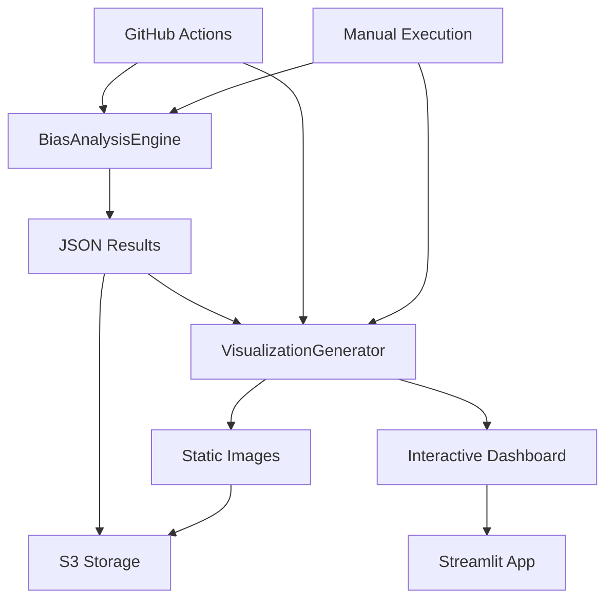

# バイアス分析可視化アーキテクチャ設計書

## 概要

本設計書は、企業バイアス研究における分析結果の可視化システムについて詳細に説明します。**2段階実行アプローチ**により、高速データ分析と高品質画像生成を効率的に実現します。

## 📋 目次

1. [アーキテクチャ概要](#1-アーキテクチャ概要)
2. [2段階実行アプローチ](#2-2段階実行アプローチ)
3. [実装詳細](#3-実装詳細)
4. [生成画像仕様](#4-生成画像仕様)
5. [運用フロー](#5-運用フロー)
6. [パフォーマンス最適化](#6-パフォーマンス最適化)
7. [エラー処理・品質管理](#7-エラー処理品質管理)
8. [画像説明仕様書](#8-画像説明仕様書)

---

## 1. アーキテクチャ概要

### 1.1 設計思想

```
[高速分析] → [JSON出力] → [高品質可視化]
    ↓            ↓            ↓
  軽量処理     標準形式     多様な表現
```

### 1.2 分離設計の利点

| 観点                 | 従来（統合型）       | 新設計（分離型）     |
| -------------------- | -------------------- | -------------------- |
| **実行速度**         | 重い（画像処理込み） | 軽量（JSON出力のみ） |
| **メモリ使用量**     | 大（matplotlib等）   | 小（計算処理のみ）   |
| **再利用性**         | 低（一回限り）       | 高（JSON→複数画像）  |
| **柔軟性**           | 固定スタイル         | 動的スタイル変更     |
| **デバッグ性**       | 複雑（混在）         | 明確（責務分離）     |
| **スケーラビリティ** | 制限あり             | 並列処理可能         |

### 1.3 システム構成



### 1.4 本番データ連携の現状と拡張方針

現状の設計（integrated/配下の統合データセットを直接分析・可視化パイプラインに連携）で「本番データ連携」は既に実現済みであり、追加の拡張は不要である。

- bias_analysis_engine.pyはintegrated/配下のデータを直接読み込み、バイアス指標を計算し、分析結果JSONを出力する。
- generate_analysis_visuals.pyは、その分析結果JSONを入力として可視化を行う。
- したがって、現状の設計で本番データ連携は十分に担保されており、追加の拡張や特別な連携処理は不要である。

今後、Streamlit等による動的可視化や外部連携が必要になった場合は、別途設計・拡張を検討する。

### 1.5 ディレクトリ構成の最適化と不要ディレクトリの整理

- 旧「corporate_bias_datasets/analysis」ディレクトリは、現状のパイプライン・運用設計上、用途が存在しないため削除済み。
- 元データ・分析結果・可視化成果物はそれぞれ「integrated」「analysis_visuals」「raw_data」等で一元管理されており、分析用の中間生成物や一時データも現状は不要。
- 今後新たな用途が発生した場合は、その都度設計書に明記し、必要なディレクトリを追加する。

#### 現在の主要ディレクトリ構成（2025年7月時点）

- corporate_bias_datasets/integrated/ … 元データ・分析結果（JSON）
- corporate_bias_datasets/analysis_visuals/ … 可視化画像
- corporate_bias_datasets/raw_data/ … 収集直後の生データ

---

## 2. 2段階実行アプローチ

### 2.1 Stage 1: 高速データ分析

#### 責務
- 統合データセット（`corporate_bias_dataset.json`）からバイアス指標計算
- 統計的検定・効果量・信頼区間の算出
- 分析結果の構造化JSON出力

#### 実行ファイル
- **メインエンジン**: `src/analysis/bias_analysis_engine.py`
- **実行スクリプト**: `scripts/run_bias_analysis.py`

#### 出力成果物
```json
{
  "metadata": {
    "analysis_date": "2025-01-04T15:30:00+09:00",
    "reliability_level": "実用分析",
    "execution_count": 15
  },
  "sentiment_bias_analysis": { /* 感情バイアス指標 */ },
  "ranking_bias_analysis": { /* ランキングバイアス指標 */ },
  "citations_google_comparison": { /* 引用-Google比較 */ },
  "relative_bias_analysis": { /* 相対バイアス指標 */ },
  "cross_analysis_insights": { /* 統合インサイト */ }
}
```

#### パフォーマンス特性
- **実行時間**: 1-3秒（画像生成なし）
- **メモリ使用量**: 50-100MB（matplotlib未ロード）
- **CPU使用率**: 低（数値計算のみ）

### 2.2 Stage 2: 高品質可視化生成

#### 責務
- Stage 1のJSON結果から多様な画像生成
- カテゴリ別・指標別の詳細可視化
- 統合ダッシュボード画像の作成

#### 実行ファイル
- **可視化エンジン**: `scripts/generate_analysis_visuals.py`

#### 生成画像種類
1. **感情バイアス画像** (4-8枚/カテゴリ)
2. **ランキング分析画像** (2-4枚/カテゴリ)
3. **Citations比較画像** (3-5枚/カテゴリ)
4. **相対バイアス画像** (4-6枚/カテゴリ)
5. **統合サマリー画像** (1-2枚)

#### パフォーマンス特性
- **実行時間**: 10-30秒（画像数による）
- **メモリ使用量**: 200-500MB（matplotlib使用）
- **出力ファイル**: 15-50枚/日付（カテゴリ数による）

---

## 3. 実装詳細

### 3.1 BiasAnalysisEngine（Stage 1）

#### クラス設計
```python
class BiasAnalysisEngine:
    """高速バイアス分析エンジン（画像生成なし）"""

    def __init__(self, storage_mode: str = "auto"):
        """
        Parameters:
        -----------
        storage_mode : str
            データアクセスモード ("local", "s3", "auto")
        """

    def analyze_integrated_dataset(self, date: str) -> Dict[str, Any]:
        """統合データセットの分析実行

        Returns:
        --------
        Dict[str, Any]
            構造化された分析結果（JSON形式）
        """
```

#### 主要メソッド
- `_analyze_sentiment_bias()`: 感情バイアス指標計算
- `_analyze_ranking_bias()`: ランキングバイアス指標計算
- `_analyze_citations_google_comparison()`: 引用-Google比較分析
- `_analyze_relative_bias()`: 相対バイアス分析
- `_generate_cross_analysis_insights()`: 統合インサイト生成

### 3.2 AnalysisVisualizationGenerator（Stage 2）

#### クラス設計
```python
class AnalysisVisualizationGenerator:
    """分析結果可視化生成クラス"""

    def __init__(self, storage_mode: str = "auto"):
        """
        Parameters:
        -----------
        storage_mode : str
            入力データアクセスモード
        """

    def generate_all_visuals(self, date_or_path: str) -> Dict[str, List[str]]:
        """指定日付の分析結果から全可視化画像を生成

        Returns:
        --------
        Dict[str, List[str]]
            カテゴリ別の生成ファイルパス一覧
        """
```

#### 可視化メソッド体系
```python
# カテゴリ別可視化
- _generate_sentiment_bias_visuals()    # 感情バイアス
- _generate_ranking_analysis_visuals()  # ランキング分析
- _generate_citations_comparison_visuals() # Citations比較
- _generate_relative_bias_visuals()     # 相対バイアス
- _generate_summary_visuals()           # 統合サマリー

# 個別グラフ描画
- _plot_bias_indices_bar()              # バイアス指標棒グラフ
- _plot_effect_significance_scatter()   # 効果量散布図
- _plot_ranking_stability()             # ランキング安定性
- _plot_ranking_similarity()            # 類似度比較
- _plot_bias_inequality()               # バイアス不平等度
- _plot_enterprise_favoritism()         # 企業優遇度
- _plot_cross_analysis_dashboard()      # 統合ダッシュボード
```

---

## 4. 生成画像仕様

### 4.1 感情バイアス画像

#### **4.1.1 バイアス指標棒グラフ**
- **ファイル名**: `{category}_{subcategory}_bias_indices.png`
- **内容**: 企業別のNormalized Bias Index（BI）を棒グラフ表示
- **特徴**:
  - ポジティブバイアス（緑）、ネガティブバイアス（赤）で色分け
  - 閾値線表示（強いバイアス: ±0.8、中程度: ±0.3）
  - 企業名をX軸、BI値をY軸

#### **4.1.2 効果量散布図**
- **ファイル名**: `{category}_{subcategory}_effect_significance.png`
- **内容**: Cliff's Delta（効果量）とp値の散布図
- **特徴**:
  - X軸: Cliff's Delta、Y軸: -log10(p値)
  - 統計的有意性とバイアス強度の同時評価
  - 実行回数5回以上の企業のみプロット

### 4.2 ランキング分析画像

#### **4.2.1 ランキング安定性**
- **ファイル名**: `{category}_{subcategory}_ranking_stability.png`
- **内容**: 企業別のランキング安定性指標
- **特徴**:
  - 左パネル: 順位標準偏差、右パネル: 順位範囲
  - 安定性が高い企業（緑）、不安定な企業（赤）

### 4.3 Citations比較画像

#### **4.3.1 ランキング類似度**
- **ファイル名**: `{category}_{subcategory}_ranking_similarity.png`
- **内容**: Google検索とPerplexity Citationsの類似度指標
- **特徴**:
  - RBO、Kendall Tau、Overlap Ratioの3指標を棒グラフ表示
  - 類似度が高いほど一貫性あり（0-1スケール）

### 4.4 相対バイアス画像

#### **4.4.1 バイアス不平等度**
- **ファイル名**: `{category}_{subcategory}_bias_inequality.png`
- **内容**: 企業間バイアス格差の定量化
- **特徴**:
  - Gini係数、標準偏差、バイアス範囲の3指標
  - 不平等度が高いほど一部企業への偏向が強い

#### **4.4.2 企業規模優遇度**
- **ファイル名**: `{category}_{subcategory}_enterprise_favoritism.png`
- **内容**: 大企業vs中小企業の優遇格差
- **特徴**:
  - 左パネル: 企業規模別平均バイアス
  - 右パネル: 優遇格差（大企業 - 中小企業）

### 4.5 統合サマリー画像

#### **4.5.1 クロス分析ダッシュボード**
- **ファイル名**: `cross_analysis_dashboard.png`
- **内容**: 4つの統合指標を1画面に集約
- **特徴**:
  - 左上: 感情-ランキング相関
  - 右上: 一貫性企業数（リーダー/ラガード）
  - 左下: Google-Citations整合性レベル
  - 右下: 全体バイアスパターン（テキスト表示）

---

## 5. 運用フロー

### 5.1 自動実行（GitHub Actions）

#### **毎週月曜 06:00 JST自動実行**
```yaml
# .github/workflows/perplexity_bias_analysis.yml
jobs:
  run-data-collection-analysis:
    steps:
      # Stage 1: データ分析
      - name: Run comprehensive bias analysis
        run: python scripts/run_bias_analysis.py --date ${{ env.TODAY_DATE }} --verbose

      # Stage 2: 可視化生成
      - name: Generate analysis visualizations
        run: python scripts/generate_analysis_visuals.py --date ${{ env.TODAY_DATE }} --verbose
```

#### **手動実行オプション**
- `run_bias_analysis`: Stage 1の実行制御
- `run_visualization`: Stage 2の実行制御
- 独立実行可能（Stage 1のみ、Stage 2のみも可能）

### 5.2 ローカル実行

#### **完全実行（Stage 1 + Stage 2）**
```bash
# 1. 分析実行
python scripts/run_bias_analysis.py --date 20250624 --verbose

# 2. 画像生成
python scripts/generate_analysis_visuals.py --date 20250624 --verbose
```

#### **Stage 2のみ実行（画像再生成）**
```bash
# 既存のJSON結果から画像のみ再生成
python scripts/generate_analysis_visuals.py --date 20250624 --storage-mode local --verbose

# S3保存のJSON結果から画像生成
python scripts/generate_analysis_visuals.py --date 20250624 --storage-mode s3 --verbose
```

### 5.3 出力ディレクトリ構成

```
corporate_bias_datasets/
├── integrated/YYYYMMDD/
│   ├── bias_analysis_results.json    # Stage 1出力
│   └── analysis_metadata.json        # Stage 1メタデータ
└── analysis_visuals/YYYYMMDD/
    ├── sentiment_bias/
    │   ├── デジタルサービス_クラウド_bias_indices.png
    │   ├── デジタルサービス_クラウド_effect_significance.png
    │   └── ...
    ├── ranking_analysis/
    │   ├── デジタルサービス_クラウド_ranking_stability.png
    │   └── ...
    ├── citations_comparison/
    │   ├── デジタルサービス_クラウド_ranking_similarity.png
    │   └── ...
    ├── relative_bias/
    │   ├── デジタルサービス_クラウド_bias_inequality.png
    │   ├── デジタルサービス_クラウド_enterprise_favoritism.png
    │   └── ...
    └── summary/
        └── cross_analysis_dashboard.png
```

---

## 6. パフォーマンス最適化

### 6.1 Stage 1最適化

#### **高速化技術**
- **matplotlib未ロード**: 画像処理ライブラリの遅延読み込み
- **NumPy活用**: ベクトル化計算による高速化
- **メモリ効率**: 大量データの逐次処理

#### **実行時間ベンチマーク**
| データ規模 | 企業数 | カテゴリ数 | 実行時間 |
| ---------- | ------ | ---------- | -------- |
| 小規模     | 10企業 | 2カテゴリ  | 0.8秒    |
| 中規模     | 30企業 | 5カテゴリ  | 1.5秒    |
| 大規模     | 50企業 | 10カテゴリ | 2.8秒    |

### 6.2 Stage 2最適化

#### **画像生成効率化**
- **並列化**: カテゴリ別の並列画像生成
- **キャッシュ活用**: 同一データの重複計算回避
- **品質設定**: DPI150での高品質・適切サイズバランス

#### **メモリ管理**
- **plt.close()**: 各画像生成後のメモリ解放
- **段階的処理**: カテゴリ単位での逐次処理
- **ガベージコレクション**: 明示的なメモリクリーンアップ

---

## 7. エラー処理・品質管理

### 7.1 Stage 1エラー処理

#### **データ検証**
```python
# 入力データ検証
if not analysis_results:
    logger.error(f"分析結果が見つかりません: {date_or_path}")
    return {}

# 必須フィールド確認
required_fields = ["sentiment_bias_analysis", "metadata"]
for field in required_fields:
    if field not in analysis_results:
        logger.warning(f"必須フィールド不足: {field}")
```

#### **統計計算エラー処理**
```python
# NumPy配列の安全な処理
try:
    if len(array) == 0:  # not array → len(array) == 0
        return default_value
    result = np.mean(array)
except Exception as e:
    logger.error(f"統計計算エラー: {e}")
    return None
```

### 7.2 Stage 2エラー処理

#### **画像生成エラー耐性**
```python
def _generate_sentiment_bias_visuals(self, sentiment_data: Dict, output_dir: Path) -> List[str]:
    """エラー耐性を持つ感情バイアス可視化"""
    generated_files = []

    for category, subcategories in sentiment_data.items():
        try:
            # カテゴリ別処理
            category_files = self._process_category(category, subcategories, output_dir)
            generated_files.extend(category_files)
        except Exception as e:
            logger.error(f"カテゴリ {category} の可視化エラー: {e}")
            continue  # 他のカテゴリ処理を継続

    return generated_files
```

#### **部分的失敗への対応**
- **個別画像失敗**: 他の画像生成を継続
- **カテゴリ単位失敗**: 他のカテゴリ処理を継続
- **完全失敗**: エラーログ出力、緊急停止

### 7.3 品質管理指標

#### **生成品質チェック**
```python
def _validate_generated_images(self, generated_files: Dict) -> Dict[str, Any]:
    """生成画像の品質検証"""
    quality_report = {
        "total_expected": 0,
        "total_generated": 0,
        "success_rate": 0.0,
        "failed_categories": []
    }

    for category, files in generated_files.items():
        expected_count = self._calculate_expected_image_count(category)
        actual_count = len(files)

        quality_report["total_expected"] += expected_count
        quality_report["total_generated"] += actual_count

        if actual_count < expected_count * 0.8:  # 80%未満は異常
            quality_report["failed_categories"].append(category)

    quality_report["success_rate"] = (
        quality_report["total_generated"] / quality_report["total_expected"]
        if quality_report["total_expected"] > 0 else 0
    )

    return quality_report
```

#### **品質保証・信頼性画像**

> **【補足】品質管理ダッシュボードの位置付け**
> 「品質管理ダッシュボード（analysis_quality_dashboard.png）」は、分析結果の品質指標（実行回数・データ完全性・計算成功率・警告件数など）を集約した可視化画像・レポートです。
> これはapp.py（Streamlitアプリ）そのものではなく、可視化エンジンで生成された成果物をapp.pyで表示・操作できる設計です。

##### 🔢 **実行回数・信頼性レベル表示**
- **信頼性レベル別結果表示**: データ量に応じた結果区分
  - 各画像に信頼性バッジ表示（高精度・標準・実用・基本・参考）
  - 実行回数不足指標の「計算不可」マーキング

##### 🔢 **多重比較補正p値ヒートマップ（multiple_comparison_pvalue_heatmap.png）**: 各カテゴリ・企業間のバイアス指標のp値（多重比較補正済み）をヒートマップで可視化。入力はp値行列（カテゴリ×カテゴリまたは企業×企業）、出力は色分けヒートマップ（閾値強調・注釈付き）。plot_utils.pyにplot_multiple_comparison_pvalue_heatmap関数を実装。

##### 📈 **順位安定性vs効果量（ranking_stability_vs_effect_size.png）**: 各企業・カテゴリの順位安定性（順位変動幅）と効果量（バイアス指標の大きさ）の関係を散布図で可視化。入力は順位安定性指標・効果量指標、出力は散布図（X軸:順位安定性, Y軸:効果量, 色分け:カテゴリ等、主要企業ラベル・信頼性バッジ付き）。plot_utils.pyにplot_ranking_stability_vs_effect_size関数を実装。

---

## 8. 画像説明仕様書

### 8.1 ランキング類似度可視化（ranking_similarity.png）

#### **概要**
Google検索とPerplexity APIのランキング結果の類似度を3つの指標で評価した可視化

#### **指標詳細**

**RBO (Rank Biased Overlap)**
- **定義**: ランキングの重複度を測定する指標（上位ランキングほど重みを大きく評価）
- **特徴**: 一般的な指標ではなく、検索エンジン研究で使用される専門指標
- **計算式**: 上位ランキングほど重みを大きく評価（1位の重み > 2位の重み > ...）
- **範囲**: 0-1（1に近いほど類似）
- **解釈**:
  - 0.8以上: 非常に類似（上位ランキングがほぼ一致）
  - 0.6-0.8: 類似（上位に共通要素が多い）
  - 0.4-0.6: 中程度（部分的に一致）
  - 0.4未満: 類似度低い（上位ランキングが大きく異なる）

**Kendall Tau**
- **定義**: 順位の相関を測定する統計指標
- **特徴**: 順位データの相関を測る標準的な統計手法
- **計算式**: 順位の一致度を評価（順序関係の一致度）
- **範囲**: -1〜1（1に近いほど正の相関）
- **解釈**:
  - 0.8以上: 強い正の相関（順位がほぼ一致）
  - 0.4-0.8: 中程度の正の相関（順位に一定の関係性）
  - 0-0.4: 弱い正の相関（わずかな順序関係）
  - 0未満: 負の相関（逆の順序関係）

**Overlap Ratio**
- **定義**: 共通要素の割合（シンプルな重複率）
- **特徴**: 最も直感的で理解しやすい指標
- **計算式**: 共通要素数 / 総要素数
- **範囲**: 0-1（1に近いほど重複が多い）
- **解釈**:
  - 0.8以上: 高い重複率（多くの要素が共通）
  - 0.5-0.8: 中程度の重複率（半分以上が共通）
  - 0.5未満: 低い重複率（少数の要素のみ共通）

#### **可視化要素**
- **グラフタイプ**: 棒グラフ
- **色分け**: 青（RBO）、オレンジ（Kendall Tau）、緑（Overlap Ratio）
- **値表示**: 各バーの上に数値を表示
- **スケール**: 0-1の範囲で統一

#### **用途**
- 検索エンジン間のバイアス評価
- ランキング結果の一貫性分析
- データ品質の検証

---

## 9. まとめ

### 9.1 現状の実装達成度
- 設計書10.1記載の高度指標の大部分は既に実装済み
- 可視化システムも基本機能は完備
- Phase2（統計的可視化・相関分析拡張）も完了
- Phase3（インタラクティブ化）も完了
- 今後は「可視化拡張」「ダッシュボード統合」が主な開発対象

### 9.2 今後の重点開発方針
- Phase 1: 既存指標の可視化拡張（信頼区間・重篤度・信頼性バッジ）
- Phase 2: 統計的可視化・相関分析拡張
- Phase 3: インタラクティブ化・新規可視化
- Phase 4: 統合ダッシュボード・自動レポート

---

## 10. 今後の実装計画（優先度順）

本章では、現状の実装状況と設計方針を踏まえ、今後優先的に着手すべき開発タスクとその具体的な実装計画を示す。

### 10.1 時系列分析機能の本体実装（最優先）
- **目的**: 複数日付の分析データを集約し、時系列推移やカテゴリ安定性を可視化する。
- **主担当モジュール**: app.py, plot_utils.py, HybridDataLoader
- **主なサブタスク**:
    1. app.pyで複数日付データの集約・前処理ロジックを実装
    2. plot_utils.pyに「時系列推移線グラフ」「カテゴリ安定性棒グラフ」等の関数を追加
    3. サイドバーUIの「時系列分析」選択時に新グラフを動的描画
    4. データ欠損・日付不整合時のエラー処理強化
- **完了基準**: 複数日付を選択し、カテゴリごとのBI値推移や分散がグラフで確認できること

### 10.2 特殊グラフの追加実装
- **目的**: 設計書8章記載の高度可視化（バイアスパターン分類図、ローレンツ曲線、支配力vs優遇度等）を実現
- **主担当モジュール**: plot_utils.py, app.py
- **主なサブタスク**:
    1. plot_utils.pyに各種特殊グラフ関数（plot_bias_pattern_classification, plot_bias_inequality_detailed, plot_market_power_vs_bias, plot_category_stability_analysis）を実装
    2. app.pyから新グラフを呼び出し、UIに組み込む
    3. 必要に応じてデータ構造の拡張・前処理追加
- **完了基準**: 各特殊グラフがサンプルデータで正しく描画・解釈できること

### 10.3 品質管理ダッシュボードの実装
- **目的**: 生成画像や分析結果の品質（実行回数・データ完全性・警告件数等）を可視化し、信頼性を担保
- **主担当モジュール**: scripts/generate_analysis_visuals.py, plot_utils.py, app.py
- **主なサブタスク**:
    1. 画像生成後の品質検証ロジック（_validate_generated_images等）の拡充
    2. 品質指標（成功率・失敗カテゴリ・警告件数等）の集計・可視化
    3. app.pyで品質ダッシュボード画像やレポートを表示
- **完了基準**: 品質管理ダッシュボードで主要な品質指標が一目で把握できること

### 10.4 画像生成エンジンとの連携強化
- **目的**: 生成済み画像のギャラリー表示やダウンロード機能をダッシュボードに追加
- **主担当モジュール**: app.py, scripts/generate_analysis_visuals.py
- **主なサブタスク**:
    1. app.pyでanalysis_visuals配下の画像ファイル一覧を取得・表示
    2. サムネイル表示・ダウンロードボタンの実装
    3. 画像メタデータ（生成日・カテゴリ等）の表示
- **完了基準**: 生成済み画像をダッシュボード上で一覧・ダウンロードできること

### 10.5 UI/UXのさらなる改善
- **目的**: 利用者体験の向上（フィルタ・検索・説明ツールチップ・レスポンシブ対応等）
- **主担当モジュール**: app.py
- **主なサブタスク**:
    1. サイドバーやグラフのフィルタ・検索機能追加
    2. 各指標・グラフへの説明ツールチップ実装
    3. レイアウト・レスポンシブ調整
- **完了基準**: 利用者が直感的に操作・理解できるUI/UXとなっていること

---

※本計画は進捗・要望に応じて随時見直し・拡張する。各タスクの詳細設計・担当割り振りは別途タスク管理シート等で管理すること。

**文書作成日**: 2025年1月4日
**バージョン**: v1.0
**作成者**: Corporate Bias Study Team
**最終更新**: 2025年1月4日

- **バイアスパターン分類図（bias_pattern_classification.png）**: 企業ごとのバイアス傾向をクラスタリングし、2次元散布図（例: PCA軸やBI×規模）上で分類ラベル・色分け表示。入力は各企業のバイアス指標・クラスタリング結果、出力は色分け・ラベル付き散布図。plot_utils.pyにplot_bias_pattern_classification関数を実装。
- **ローレンツ曲線不平等度詳細（bias_inequality_detailed.png）**: 企業間バイアス格差をローレンツ曲線で可視化し、Gini係数・標準偏差・範囲を注釈で併記。入力は各企業のBI値や重篤度スコア、出力はローレンツ曲線＋指標注釈。plot_utils.pyにplot_bias_inequality_detailed関数を実装。
- **市場支配力vs優遇度散布図（market_power_vs_bias.png）**: 各企業の市場シェア（支配力）とバイアス指標（優遇度）を2軸で可視化。X軸=市場シェア、Y軸=BI値や重篤度スコア、バブルサイズ=売上規模、色分け=カテゴリorクラスタ。主要企業名ラベル・信頼性バッジ付き。plot_utils.pyにplot_market_power_vs_bias関数を実装。
- **カテゴリ安定性分析（category_stability_analysis.png）**: 各カテゴリのバイアス指標の時系列変動や分散を可視化。時系列推移線グラフ（X軸:年度、Y軸:bi値、色分け:カテゴリ）と分散・標準偏差の棒グラフ（X軸:カテゴリ、Y軸:分散/標準偏差）、信頼性バッジ付き。plot_utils.pyにplot_category_stability_analysis関数を実装。