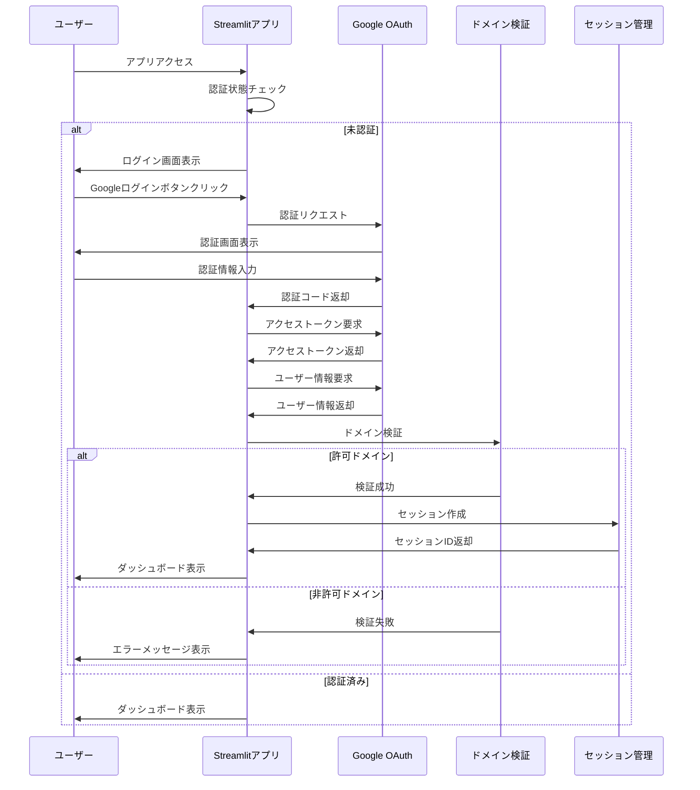

# OAuth認証機能 README

## 概要

企業バイアス分析システムでは、Google OAuth 2.0を使用した認証機能を実装しています。この機能により、サイバー大学（@cyber-u.ac.jp）ドメインのユーザーのみがシステムにアクセスできるようになっています。

## 機能一覧

### 1. Google OAuth 2.0認証
- Googleアカウントを使用したシングルサインオン（SSO）
- セキュアなトークンベース認証
- 自動的なセッション管理

### 2. ドメイン制限機能
- サイバー大学ドメイン（@cyber-u.ac.jp）のみアクセス許可
- 設定可能な許可ドメインリスト
- リアルタイムドメイン検証

### 3. セッション管理
- JWTトークンベースのセッション管理
- 自動セッションタイムアウト（デフォルト：1時間）
- セッション更新機能

### 4. セキュリティ機能
- トークン暗号化
- CSRF保護
- セキュアな環境変数管理

## システム構成

```
src/auth/
├── google_oauth.py      # Google OAuth認証管理
├── domain_validator.py  # ドメイン制限チェック
└── session_manager.py   # セッション管理

src/components/
└── auth_ui.py          # 認証UIコンポーネント

src/utils/
└── auth_utils.py       # 認証関連ユーティリティ
```

## 認証フロー



## 設定方法

### 1. 環境変数設定

`.env`ファイルに以下の設定を追加してください：

```bash
# OAuth認証設定
OAUTH_FLAG=true

# Google OAuth設定
GOOGLE_CLIENT_ID=your_client_id
GOOGLE_CLIENT_SECRET=your_client_secret
GOOGLE_REDIRECT_URI=http://localhost:8501

# 認証設定
ALLOWED_DOMAINS=cyber-u.ac.jp
AUTH_DEBUG_MODE=false
SESSION_TIMEOUT=3600

# セキュリティ設定
JWT_SECRET_KEY=your_jwt_secret_key_change_this_in_production
ENCRYPTION_KEY=your_encryption_key_change_this_in_production
```

### 2. Google Cloud Console設定

1. **プロジェクト作成**
   - Google Cloud Consoleで新規プロジェクトを作成

2. **OAuth同意画面設定**
   - 「OAuth同意画面」を設定
   - ユーザータイプ：外部
   - テストユーザーにcyber-u.ac.jpドメインを追加

3. **認証情報作成**
   - 「認証情報」→「OAuth 2.0 クライアントID」を作成
   - アプリケーション種別：ウェブアプリケーション
   - 承認済みリダイレクトURI：
     - ローカル開発：`http://localhost:8501`
     - 本番環境：実際のURL

4. **認証情報取得**
   - クライアントIDとクライアントシークレットを取得
   - `.env`ファイルに設定

### 3. 必要なライブラリ

`requirements-app.txt`に以下のライブラリが含まれています：

```txt
# OAuth認証関連
authlib>=1.2.0
requests-oauthlib>=1.3.0
PyJWT>=2.8.0
cryptography>=41.0.0
streamlit-oauth>=0.0.1
```

## 使用方法

### 1. 認証機能の有効化/無効化

環境変数`OAUTH_FLAG`で認証機能を制御できます：

```bash
# 認証機能を有効化（デフォルト）
OAUTH_FLAG=true

# 認証機能を無効化（誰でもアクセス可能）
OAUTH_FLAG=false
```

### 2. 許可ドメインの変更

環境変数`ALLOWED_DOMAINS`で許可ドメインを設定できます：

```bash
# 単一ドメイン
ALLOWED_DOMAINS=cyber-u.ac.jp

# 複数ドメイン（カンマ区切り）
ALLOWED_DOMAINS=cyber-u.ac.jp,example.com,test.org
```

### 3. セッションタイムアウトの設定

環境変数`SESSION_TIMEOUT`でセッションタイムアウトを設定できます：

```bash
# 1時間（3600秒）
SESSION_TIMEOUT=3600

# 30分（1800秒）
SESSION_TIMEOUT=1800
```

## 主要クラス・関数

### GoogleOAuthManager

Google OAuth認証のメイン管理クラス

```python
from src.auth.google_oauth import GoogleOAuthManager

# インスタンス作成
oauth_manager = GoogleOAuthManager()

# 認証URL生成
auth_url = oauth_manager.get_auth_url()

# コールバック処理
result = oauth_manager.handle_callback(code)

# 認証状態チェック
is_auth = oauth_manager.is_authenticated()

# ユーザー情報取得
user_info = oauth_manager.get_user_info()
```

### DomainValidator

ドメイン制限チェッククラス

```python
from src.auth.domain_validator import DomainValidator

# インスタンス作成
validator = DomainValidator(["cyber-u.ac.jp"])

# メールアドレス検証
is_valid = validator.validate_email("user@cyber-u.ac.jp")

# ドメイン抽出
domain = validator.get_user_domain("user@cyber-u.ac.jp")
```

### SessionManager

セッション管理クラス

```python
from src.auth.session_manager import SessionManager, UserInfo

# インスタンス作成
session_manager = SessionManager()

# セッション作成
user_info = UserInfo("user@cyber-u.ac.jp", "User Name")
session_id = session_manager.create_session(user_info)

# セッション検証
is_valid = session_manager.validate_session(session_id)

# セッション破棄
session_manager.destroy_session()
```

## エラーハンドリング

### よくあるエラーと対処法

1. **認証設定エラー**
   ```
   エラー: GOOGLE_CLIENT_IDが設定されていません
   対処法: .envファイルにGoogle OAuth認証情報を設定
   ```

2. **ドメイン制限エラー**
   ```
   エラー: ドメイン制限: example.comは許可されていません
   対処法: ALLOWED_DOMAINSに該当ドメインを追加
   ```

3. **セッションタイムアウト**
   ```
   エラー: セッションが期限切れです
   対処法: 再ログインが必要
   ```

4. **トークン取得エラー**
   ```
   エラー: トークン取得エラー
   対処法: Google Cloud Consoleの設定を確認
   ```

## セキュリティ考慮事項

### 1. 環境変数の管理
- 機密情報は必ず環境変数で管理
- `.env`ファイルをGitにコミットしない
- 本番環境では適切なシークレット管理を使用

### 2. HTTPS通信
- 本番環境では必ずHTTPSを使用
- Google Cloud ConsoleでHTTPSリダイレクトURIを設定

### 3. トークン管理
- アクセストークンは適切に暗号化
- セッションタイムアウトを適切に設定
- 不要なトークンは即座に破棄

### 4. ログ管理
- 認証イベントを適切にログ出力
- エラー情報の適切な管理
- 個人情報のログ出力を避ける

## トラブルシューティング

### 1. 認証が通らない場合

1. **環境変数の確認**
   ```bash
   # 必要な環境変数が設定されているか確認
   echo $GOOGLE_CLIENT_ID
   echo $GOOGLE_CLIENT_SECRET
   echo $GOOGLE_REDIRECT_URI
   ```

2. **Google Cloud Console設定の確認**
   - OAuth同意画面の設定
   - 承認済みリダイレクトURIの設定
   - テストユーザーの追加

3. **ログの確認**
   ```python
   # デバッグモードを有効化
   AUTH_DEBUG_MODE=true
   ```

### 2. セッションが切れる場合

1. **セッションタイムアウトの確認**
   ```bash
   # 現在の設定を確認
   echo $SESSION_TIMEOUT
   ```

2. **JWTシークレットの確認**
   ```bash
   # JWTシークレットが設定されているか確認
   echo $JWT_SECRET_KEY
   ```

### 3. ドメイン制限でエラーになる場合

1. **許可ドメインの確認**
   ```bash
   # 現在の設定を確認
   echo $ALLOWED_DOMAINS
   ```

2. **ドメイン形式の確認**
   - ドメインは小文字で設定
   - カンマ区切りで複数ドメイン指定可能

## 開発・テスト

### 1. ローカル開発環境

```bash
# 環境変数設定
cp .env_sample .env
# .envファイルを編集して認証情報を設定

# アプリ起動
streamlit run app.py
```

### 2. テスト用設定

```bash
# テスト用環境変数
OAUTH_FLAG=true
AUTH_DEBUG_MODE=true
ALLOWED_DOMAINS=cyber-u.ac.jp,test.com
SESSION_TIMEOUT=1800
```

### 3. デバッグ機能

デバッグモードを有効化すると、詳細なログが出力されます：

```bash
AUTH_DEBUG_MODE=true
```

## 今後の拡張予定

### 1. 機能拡張
- 多要素認証（MFA）対応
- 管理者権限の実装
- ユーザー管理機能

### 2. セキュリティ強化
- レート制限機能
- IPアドレス制限
- 異常検知機能

### 3. 運用機能
- 認証ログの可視化
- ユーザー統計表示
- 自動バックアップ機能

## 参考資料

- [Google OAuth 2.0 ドキュメント](https://developers.google.com/identity/protocols/oauth2)
- [Authlib ドキュメント](https://authlib.org/)
- [Streamlit OAuth コンポーネント](https://github.com/ai-yash/st-oauth)
- [JWT ドキュメント](https://pyjwt.readthedocs.io/)

## サポート

認証機能に関する問題や質問がある場合は、以下の手順で対応してください：

1. **ログの確認**: デバッグモードを有効化してログを確認
2. **設定の確認**: 環境変数とGoogle Cloud Console設定を確認
3. **ドキュメント参照**: 上記の参考資料を確認
4. **管理者連絡**: 解決できない場合は管理者に連絡

---
